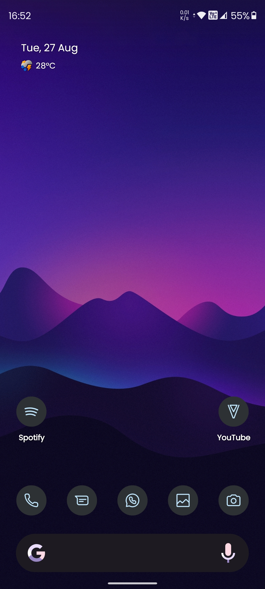
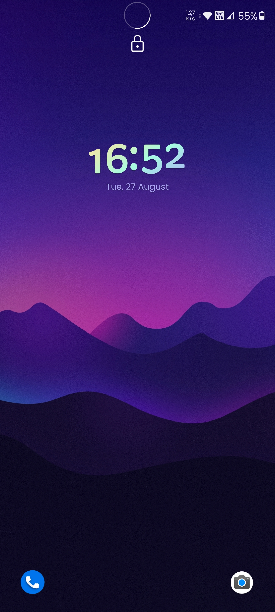
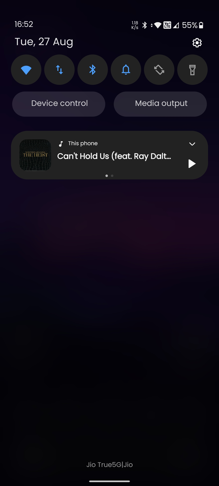
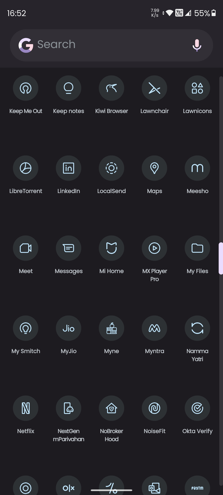
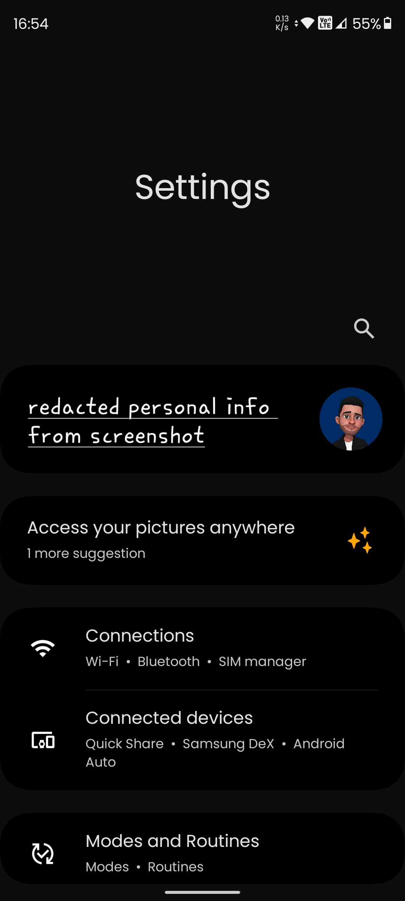

<h1>Convert Samsung One UI to AOSP-Like Experience</h1>

This guide provides detailed instructions for converting your Samsung device running One UI to an experience as close to AOSP (Android Open-Source Project) as possible. This involves several steps, including unlocking the bootloader, rooting the device, and applying customizations. Note that this guide aims to achieve an AOSP-like experience rather than flashing a full AOSP ROM, as some native samsung features and functionalities may not work properly on custom ROMs. For example, VoLTE and calling functionality may not work as expected with custom ROMs. The [**IMS**](https://github.com/phhusson/ims) project and its forks are attempting to resolve this issue, but there has been minimal success so far.

---

**Disclaimer**: This guide was tested on a Galaxy S20 FE 5G running Android 13 with One UI 5.1 and the March 2024 security patch. Proceed with caution, and ensure you fully understand each step before proceeding. Unlocking the bootloader, rooting your device, and modifying system flags carry risks. Possible issues include, but are not limited to:

- Bricking your device (making it unusable)
- Voiding your warranty
- Potential security vulnerabilities
- Loss of data or functionality
- Instability or performance issues

Proceed with caution and ensure you fully understand each step before proceeding. The author of this guide assumes no responsibility for any damage or issues that may occur as a result of following these instructions.

---

<h2>Screenshots</h2>

---

<h2>Prerequisites</h2>

Before you begin, ensure you have the following:

- **Samsung Device:** Ensure your device is fully charged or has at least 80% battery.
- **USB Cable:** Try to use an official cable for your device.
- **PC with ADB and Fastboot Installed:** Install ADB and Fastboot on your PC. You can [**follow this guide**](https://www.xda-developers.com/install-adb-windows-macos-linux/) to set it up.
- **Backup Your Data:** Unlocking the bootloader and rooting will wipe all data on your device. Make sure to back up important data.
- [**Odin**](https://odindownload.com/)**:** Download the latest version of Odin for flashing.
- [**Magisk Manager**](https://github.com/topjohnwu/Magisk/releases)**:** Download the latest Magisk Manager APK for rooting.

---

<h2>Resources</h2>

- [**SetEdit (Settings Database Editor):**](https://play.google.com/store/apps/details?id=by4a.setedit22) Install from the Google Play Store.
- [**Hex Installer**](https://play.google.com/store/apps/details?id=project.vivid.hex.bodhi)**:** Download from the Google Play Store.
- [**AOSP Plugin for Hex Installer**](https://play.google.com/store/apps/details?id=project.vivid.ui.plugin.aosps)**:** Download from the Google Play Store.
- [**Firefds Kit**](https://github.com/Firefds/FirefdsKit)**:** Download and install from the official GitHub repository.
- [**XManager**](https://github.com/Team-xManager/xManager)**:** Download and install from the official XManager repository.
- [**ReVanced Manager**](https://github.com/ReVanced/revanced-manager)**:** Download from the official ReVanced repository.
- [**Pixelify Google Photos**](https://github.com/BaltiApps/Pixelify-Google-Photos)**:** Download from the official GitHub repository.
- [**HideMyAppsList**](https://github.com/Dr-TSNG/Hide-My-Applist)**:** Download from the official GitHub repository.
- [**Google Fonts**](https://fonts.google.com/)**:** Visit Google Fonts to download custom fonts.
- [**Root Checker**](https://play.google.com/store/apps/details?id=com.joeykrim.rootcheck)**:** Download from the Google Play Store.
- [**XPrivacyLua**](https://github.com/M66B/XPrivacyLua/releases/tag/1.34)**:** Download from the official GitHub repository.
- [**YASNAC**](https://github.com/RikkaW/YASNAC)**:** Download from the official GitHub repository**.**
- [**Good Lock**](https://galaxystore.samsung.com/detail/com.samsung.android.goodlock)**:** Download from the Galaxy Store.
- [**Theme Park**](https://galaxystore.samsung.com/detail/com.samsung.android.themedesigner)**:** Download from the Galaxy Store or within Good Lock.
- [**QuickSwitch**](https://github.com/skittles9823/QuickSwitch)**:** Download from the official GitHub repository.
- [**Lawnchair 14**](https://lawnchair.app)**:** Download from the official website.
- [**Lawnicons**](https://github.com/LawnchairLauncher/lawnicons)**:** Download from the official GitHub repository.
- [**Lawnfeed**](https://github.com/LawnchairLauncher/lawnfeed)**:** Download from the official GitHub repository.
- [**Pix Icon Pack**](https://play.google.com/store/apps/details?id=ru.pt.iconpack.pixel)**:** Download from the Google Play Store.
- [**Backdrops**](https://play.google.com/store/apps/details?id=com.backdrops.wallpapers)**:** Download from the Google Play Store.
- [**Resplash**](https://play.google.com/store/apps/details?id=com.b_lam.resplash)**:** Download from the Google Play Store.
- [**Walli**](https://play.google.com/store/apps/details?id=com.shanga.walli)**:** Download from the Google Play Store.
- [**Google Phone**](https://play.google.com/store/apps/details?id=com.google.android.dialer)**:** Download from the Google Play Store.
- [**Google Messages**](https://play.google.com/store/apps/details?id=com.google.android.apps.messaging)**:** Download from the Google Play Store.
- [**GCAM**](https://www.celsoazevedo.com/files/android/google-camera/)**:** Download your device specific APK from [**XDA Developers**](https://www.xda-developers.com/) or [**GCAM Hub**](https://www.celsoazevedo.com/files/android/google-camera/)**.**
- [**Config File**](https://www.celsoazevedo.com/files/android/google-camera/)**:** Download your device specific config file from [**XDA Developers**](https://www.xda-developers.com/) or [**GCAM Hub**](https://www.celsoazevedo.com/files/android/google-camera/)**.**

---

<h2>Step 1: Unlock the Bootloader</h2>

Unlocking the bootloader is the first step in converting your Samsung device to AOSP. Here’s how to do it (This method was last validated by me during 2022, Check if it ever got updated since then):

**1.1 Enable Developer Options**

1. Go to **Settings** > **About phone** > **Software information**.
2. Find **Build number** and tap on it seven times.
3. You’ll see a message saying “You are now a developer!”

**1.2 Enable OEM Unlocking**

1. Go back to **Settings** > **Developer options** (this should now be available).
2. Find **OEM unlocking** and toggle it on.
3. Confirm your action by entering your device's PIN or password.

**1.3 Reboot into Download Mode**

1. Power off your device.
2. Press and hold the **Volume Down** and **Bixby** (or **Power** button for newer models) buttons simultaneously, then plug in your USB cable connected to your PC.
3. Your device will boot into **Download Mode**. Press the **Volume Up** button to continue.

**1.4 Unlock the Bootloader**

1. You’ll see a screen warning you about the risks of unlocking the bootloader.
2. Press the **Volume Up** button to confirm and unlock the bootloader.
3. Your device will reboot, and all data will be wiped.

**1.5 Finalize Bootloader Unlock**

1. Once the device reboots, you’ll need to go through the initial setup again.
2. Go back to **Settings** > **Developer options** and confirm that **OEM unlocking** is greyed out. This indicates the bootloader is successfully unlocked.

---

<h2>Step 2: Root Your Device Using Odin and Magisk</h2>

Rooting your Samsung device gives you full control over the system and allows you to make the necessary modifications to install an AOSP ROM. Here’s how to root your device using Odin and Magisk.

**2.1 Download the Stock Firmware**

1. Download the stock firmware for your device from [**SamMobile**](https://www.sammobile.com/) or a similar site.
2. Extract the firmware to a folder on your PC. You should see several files, including AP, BL, CP, CSC, and HOME_CSC.

**2.2 Patch the AP File with Magisk**

1. Transfer the **AP** file from the extracted firmware to your Samsung device.
2. Install the [**Magisk Manager APK**](https://github.com/topjohnwu/Magisk/releases) on your device.
3. Open **Magisk Manager** and tap on **Install** > **Select and Patch a File**.
4. Navigate to the **AP** file you transferred and select it.
5. Magisk will patch the file and save it as magisk_patched.tar in the Download folder on your device.
6. Transfer magisk_patched.tar back to your PC.

**2.3 Reboot Your Device into Download Mode**

1. Power off your device.
2. Press and hold the **Volume Down** and **Bixby**/**Power** buttons simultaneously, then plug in your USB cable connected to your PC.
3. Your device will boot into **Download Mode**.

**2.4 Flash the Patched AP File Using Odin**

1. Open [**Odin**](https://odindownload.com/) on your PC.
2. In Odin, click on the **AP** button and select the magisk_patched.tar file.
3. Load the other firmware files into their respective slots in Odin:
    - **BL**: Select the BL file.
    - **CP**: Select the CP file.
    - **CSC**: Select the HOME_CSC file (this retains your data; use CSC if you want to wipe your data).
4. Under the **Options** tab in Odin, ensure that **Auto Reboot** and **F. Reset Time** are checked. Make sure **Re-Partition** is NOT checked.
5. Click **Start** to begin the flashing process.

**2.5 Complete the Rooting Process**

1. Once the flashing is complete, your device will reboot.
2. When the device boots up, set up your device and reconnect it to the internet.
3. Install the [**Magisk Manager APK**](https://github.com/topjohnwu/Magisk/releases) again if it was removed during the flashing process.
4. Open **Magisk Manager** and follow any prompts to complete the setup.
5. Your device should now be rooted. You can verify root access by using apps like [**Root Checker**](https://play.google.com/store/apps/details?id=com.joeykrim.rootcheck).

---

<h2>Step 3: Fix Root-Related Issues (Banking Apps, Google Pay, etc.)</h2>

After rooting your device, you may encounter issues with certain apps, such as banking apps or Google Pay, which detect root and refuse to work. This step will guide you through fixing these issues using Magisk Hide, the DenyList, XPrivacyLua, LSPosed, HideMyAppsList, and the Universal SafetyNet Fix module.

**3.1 Install Magisk Modules**

1. Open **Magisk Manager** on your device.
2. Go to the **Modules** section and tap on the **Install from storage** button.
3. Install the following modules:
    - [**Universal SafetyNet Fix**](https://github.com/kdrag0n/safetynet-fix)**:** This module helps pass SafetyNet checks on rooted devices.
    - [**MagiskHide Props Config (optional)**](https://github.com/Magisk-Modules-Repo/MagiskHidePropsConf)**:** This module allows you to change device properties to make it look unrooted.
4. Reboot your device to apply the modules.

**3.2 Hide the Magisk App**

1. Open **Magisk Manager** and go to **Settings**.
2. Scroll down and tap on **Hide the Magisk app**.
3. Choose a new name for the Magisk app (e.g., "Settings Manager") and tap **OK**.
4. Magisk will repackage itself under the new name, making it harder for apps to detect root.

**3.3 Configure Magisk DenyList**

1. Open **Magisk Manager** and go to **Settings**.
2. Enable **Zygisk** (the successor to Magisk Hide) and **DenyList**.
3. Tap on **Configure DenyList**.
4. Find the apps that you want to hide root from (e.g., Google Play Services, Google Pay, banking apps) and tap on each app to expand the list of activities and services.
5. Select all relevant services and activities for each app to ensure they don't detect root.

**3.4 Install LSPosed and HideMyAppsList**

1. **Install LSPosed:**
    - Download the [**LSPosed**](https://github.com/LSPosed/LSPosed) ZIP file from the official GitHub repository.
    - In **Magisk Manager**, go to the **Modules** section and install the **LSPosed** ZIP file.
    - Reboot your device after installation.
    - After rebooting, open the **LSPosed Manager** app to verify that the module is active.
2. **Install HideMyAppsList:**
    - Download [**HideMyAppsList**](https://github.com/Dr-TSNG/Hide-My-Applist) from the official GitHub repository.
    - In **LSPosed Manager**, go to the **Modules** section and enable **HideMyAppsList**.
    - Use **HideMyAppsList** to hide specific apps (like Magisk) from other apps that may detect them.

**3.5 Use XPrivacyLua for Fine-Grained Privacy Control**

1. Install [**XPrivacyLua**](https://github.com/M66B/XPrivacyLua/releases/tag/1.34) from official GitHub repository.
2. Open **XPrivacyLua** and grant it root access.
3. Use **XPrivacyLua** to restrict specific permissions for apps that might detect root or for added privacy.
    - For example, you can restrict apps from accessing your device’s state, activities, or analytics data.

**3.6 Verify SafetyNet Status**

1. Install [**YASNAC**](https://github.com/RikkaW/YASNAC) and open it.
2. Scroll down and tap on **Run SafetyNet Attestation**.
3. If everything is configured correctly, you should see **Basic Integrity and CTS Profile Match** as **Pass**.
4. If the check fails, you may need to tweak some settings in Magisk, LSPosed, or recheck the apps using the DenyList.

---

<h2>Step 4: Customization</h2>

After you've successfully converted your device to an AOSP-like experience, it's time to make it truly yours with some customizations. This step will guide you through using Good Lock, Theme Park, SetEdit, Hex Installer, Firefds Kit, and more to give your device a polished and personalized look.

**4.1 Use Good Lock and Theme Park for Custom Icons**

1. [**Good Lock**](https://galaxystore.samsung.com/detail/com.samsung.android.goodlock)**:** Install the Good Lock app from the Galaxy Store.
2. [**Theme Park**](https://galaxystore.samsung.com/detail/com.samsung.android.themedesigner)**:** Open the Good Lock app and install the **Theme Park** module.
    - Use Theme Park to create a custom icon theme for your device.
    - Apply the [**Pix Icon Pack**](https://play.google.com/store/apps/details?id=ru.pt.iconpack.pixel) from google play store for a Pixel-like icon appearance.
    - For any icons that aren't automatically themed, you can individually assign them by tapping on the missing icon and choosing the correct one from the icon pack.

**4.2 Force 120Hz on All Apps Using SetEdit**

If your phone supports a 120Hz refresh rate, you can force all apps to use it using SetEdit:

1. **Download** [**SetEdit**](https://play.google.com/store/search?q=setedit&c=apps)**:**
    - Install **SetEdit (Settings Database Editor)** from the Google Play Store.
2. **Change the Settings:**
    - Open SetEdit and find the setting named **"min_refresh_rate"** and **"peak_refresh_rate"**.
    - If these settings don’t exist, you can add them:
        - Tap on the **Add new setting** option.
        - For **min_refresh_rate**, enter the value **"0.1"**.
        - For **peak_refresh_rate**, enter the value **"0.1"**.
    - Setting both values to **0.1** forces the system to always use the maximum refresh rate (120Hz) for all apps.
3. **Reboot Your Device:**
    - Restart your phone to apply the changes.

**4.3 Customize with Hex Installer and AOSP Plugin**

1. **Install Hex Installer:**
    - Download [**Hex Installer**](https://play.google.com/store/apps/details?id=project.vivid.hex.bodhi) from the Google Play Store.
    - Download the [**AOSP Plugin**](https://play.google.com/store/apps/details?id=project.vivid.ui.plugin.aosps) for Hex Installer.
2. **Tweak the Color Scheme:**
    - Open Hex Installer and choose a theme base.
    - Apply the AOSP Plugin to give your device an AOSP-like look.
    - Tweak the color scheme to match your personal style or vibe.
    - Reapply the icon theme using theme park if necessary.

**4.4 Install a Custom Font**

1. **Download a Pixel-Like Font:**
    - Visit [**Google Fonts**](https://fonts.google.com/) and download a font similar to **Poppins** or another pixel-like font.
2. **Apply the Font Using Hex Installer:**
    - Open Hex Installer and go to the font section.
    - Upload the downloaded font and apply it to your system.

**4.5 Use Firefds Kit to Enable Network Speed Indicator**

1. **Install Firefds Kit:**
    - Download and install [**Firefds Kit**](https://github.com/Firefds/FirefdsKit) from the official GitHub repository.
2. **Enable the Network Speed Indicator:**
    - Open **Firefds Kit** and enable the **Network Speed Indicator** from the status bar settings.
3. **Manually Toggle the Indicator:**
    - After enabling it in Firefds Kit, go to **Settings > Status bar** and manually toggle the network speed indicator on.
    - This will display the real-time network speed in the status bar.

**4.6 Install and Set Up Lawnchair 14, Lawnfeed, and Lawnicons**

1. **Install QuickSwitch via Magisk**:
    - Download and flash [**QuickSwitch**](https://github.com/skittles9823/QuickSwitch) via the Magisk Manager to allow Lawnchair to be set as the default launcher.
2. **Install Lawnchair 14**:
    - Download [**Lawnchair 14**](https://lawnchair.app) and install it on your device.
3. **Install Lawnfeed and Lawnicons**:
    - Download and install **[Lawnfeed](https://github.com/LawnchairLauncher/lawnfeed"%20\t%20"_new)** to enable Google Feed integration.
    - Download and install [**Lawnicons**](https://github.com/LawnchairLauncher/lawnicons) for additional icon packs.
4. **Set Up Lawnchair**:
    - Open Lawnchair and set it as your default launcher.
    - Customize your home screen, app drawer, and widgets according to your preferences.
    - Reapply the custom icon pack and theme created with Theme Park.
    - Adjust the lock screen shortcuts and clock to your liking.

**4.7 Customize Lock Screen and Wallpapers**

1. **Lock Screen Shortcuts**:
    - Customize lock screen shortcuts by navigating to **Settings > Lock screen**.
    - Set your favorite apps as quick-access shortcuts.
2. **Clock Customization**:
    - Customize the clock style and position from **Settings > Lock screen > Clock style**.
3. **Wallpapers**:
    - Choose wallpapers that match your theme. You can use apps like [**Walli**](https://play.google.com/store/apps/details?id=com.shanga.walli), [**Resplash**](https://play.google.com/store/apps/details?id=com.b_lam.resplash) or [**Backdrops**](https://play.google.com/store/apps/details?id=com.backdrops.wallpapers) to find high-quality wallpapers.

**4.8 Use Google Apps for a More AOSP-Like Feel**

To enhance the AOSP-like experience on your Samsung device, you can replace some of the Samsung apps with their Google counterparts:

- [**Google Phone**](https://play.google.com/store/apps/details?id=com.google.android.dialer)**:** Install the Google Phone app from the Google Play Store to replace the default Samsung dialer.
- [**Google Messages**](https://play.google.com/store/apps/details?id=com.google.android.apps.messaging)**:** Install Google Messages from the Google Play Store to replace the Samsung Messages app.

There are more Google apps available on Google Play Store that can offer stock Android interface, aligning closely with the AOSP look and feel.

---

<h2>Step 5: UX Tweaks</h2>

Enhance your user experience further with these additional tweaks.

**5.1 Ad-Free Spotify with XManager**

1. **Install XManager:**
    - Download and install [**XManager**](https://github.com/Team-xManager/xManager) from the official XManager repository.
2. **Use XManager to Get Ad-Free Spotify:**
    - Open XManager and follow the instructions to install the ad-free version of Spotify.
    - Enjoy uninterrupted music without ads.

**5.2 Ad-Free YouTube with ReVanced**

1. **Install ReVanced:**
    - Download and install [**ReVanced**](https://github.com/ReVanced/revanced-manager) from the official ReVanced repository.
2. **Use ReVanced to Get Ad-Free YouTube:**
    - Follow the instructions in ReVanced to set up the ad-free YouTube experience.
    - Watch videos without interruptions from ads.

**5.3 Unlimited Google Photos with Pixelify or ReVanced**

1. **Pixelify Google Photos:**
    - Download and install [**Pixelify Google Photos**](https://github.com/BaltiApps/Pixelify-Google-Photos) from the official GitHub repository.
    - Open Pixelify and follow the instructions to enable unlimited Google Photos storage.
2. **Alternatively, Use ReVanced:**
    - If you prefer, you can also use **ReVanced** to enable unlimited Google Photos storage.

**5.4 Set Up AdGuard DNS for Enhanced Privacy and Ad Blocking**

1. **Configure AdGuard DNS**:
    - Go to **Settings > Connections > More connection settings** on your device.
    - Click on **Private DNS**.
    - Change it **Private DNS provider hostname** and enter the custom domain:
        - **DNS**: dns.adguard.com

**5.5: Install GCAM and Add the Right Config File**

1. **Install GCAM:**
    - Download the **GCAM APK** for your device from [**XDA Developers**](https://www.xda-developers.com/) or [**GCAM Hub**](https://www.celsoazevedo.com/files/android/google-camera/).
    - Install it on your device.
2. **Apply the Config File:**
    - Download a suitable **XML config file** for your device from XDA Developers or GCAM Hub.
    - Place the XML file in the GCAM configuration folder on your device.
    - Open GCAM, go to settings, and load the config file to apply the optimized settings.

By installing GCAM and using the right configuration, you can improve the quality and functionality of your camera to better match the AOSP experience.

     
---

<h2>Final Disclaimer</h2>

Before proceeding with any of the steps mentioned, it's crucial to validate the newest update of each tool or app by checking the latest information available online. Each update may bring changes that could affect the steps or tools used in this guide. Always do thorough research and ensure you're comfortable with the customization steps before applying them to your device.

